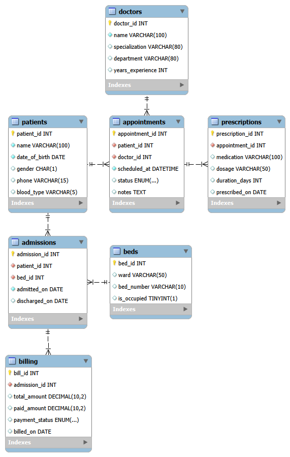
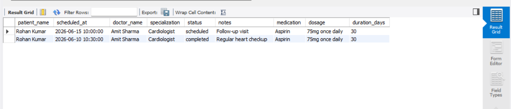
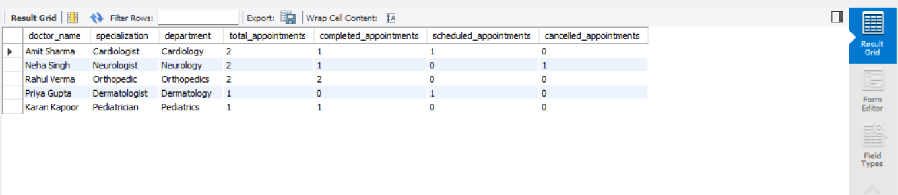
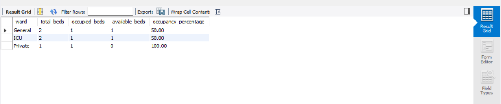
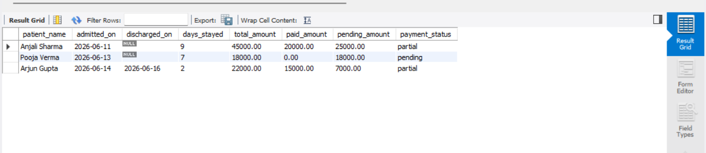
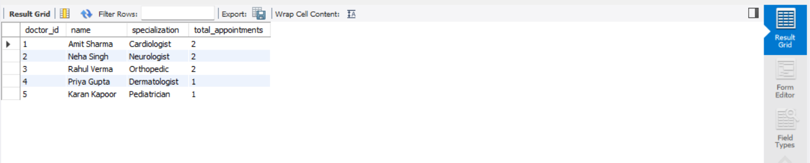
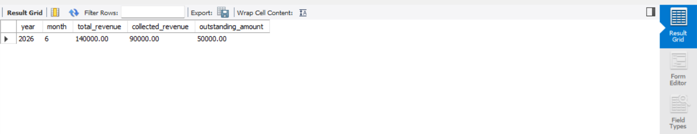
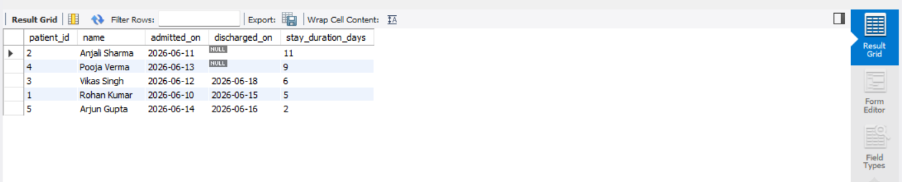
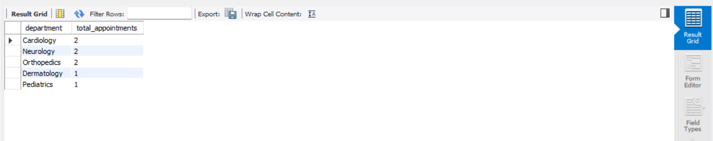
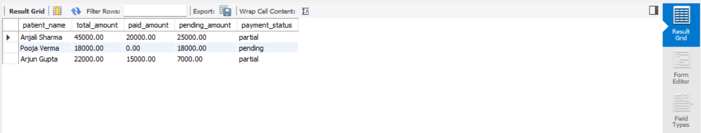

# 🏥 Hospital Patient Management System

## 📌 Project Overview

The Hospital Patient Management System is a SQL-based database project designed to manage and analyze hospital operations. The system stores information about patients, doctors, appointments, admissions, prescriptions, beds, and billing records.

The project demonstrates database design, normalization, SQL querying, business reporting, and healthcare analytics using MySQL.

---

## 🎯 Business Problem

Hospitals generate large amounts of data related to patient care, doctor schedules, admissions, and billing. Managing this data efficiently is critical for operational performance and decision-making.

This project helps answer business questions such as:

- What is a patient's complete medical history?
- Which doctors handle the highest workload?
- What is the current bed occupancy rate?
- Which patients have outstanding payments?
- Who is currently admitted to the hospital?
- Which department receives the highest number of appointments?
- How much revenue has the hospital generated and collected?

---

## 🛠️ Technologies Used

- MySQL
- MySQL Workbench
- SQL
- Relational Database Design

---

## 🗂️ Database Schema

The database consists of the following tables:

- Patients
- Doctors
- Beds
- Appointments
- Admissions
- Prescriptions
- Billing

The schema follows Third Normal Form (3NF) principles to reduce redundancy and improve data integrity.

---

## 🗄️ Entity Relationship Diagram (ERD)



---

## 📁 Project Structure

```text
hospital_pms/

├── db/
│   ├── schema.sql
│   └── seed.sql
│
├── images/
│   ├── bed_occupancy_analysis.png
│   ├── billing_summary_analysis.png
│   ├── busiest_department_analysis.png
│   ├── doctor_workload_analysis.png
│   ├── ERD.png
│   ├── long_stay_patients_analysis.png
│   ├── monthly_revenue_analysis.png
│   ├── patient_history_query_result.png
│   ├── top_doctors_analysis.png
│   └── unpaid_patients_analysis.png
│
├── queries/
│   ├── bed_occupancy.sql
│   ├── billing_summary.sql
│   ├── busiest_department.sql
│   ├── doctor_workload.sql
│   ├── long_stay_patients.sql
│   ├── monthly_revenue.sql
│   ├── patient_history.sql
│   ├── top_doctors.sql
│   └── unpaid_patients.sql
│
├── views/
│   └── active_admissions.sql
│
├── .gitignore
└── README.md
```

--- 

## 📊 SQL Analysis Queries

### 1. Patient History Analysis

Displays a patient's appointment history, doctor details, and prescribed medications.

**Concepts Used:**
- JOIN
- LEFT JOIN
- ORDER BY



---

### 2. Doctor Workload Analysis

Analyzes the number of appointments handled by each doctor.

**Concepts Used:**
- COUNT()
- GROUP BY
- CASE Statements



---

### 3. Bed Occupancy Analysis

Calculates occupied and available beds across hospital wards.

**Concepts Used:**
- Aggregate Functions
- CASE Statements
- GROUP BY



---

### 4. Billing Summary Analysis

Identifies pending payments, balances, and patient stay duration.

**Concepts Used:**
- JOIN
- DATEDIFF()
- COALESCE()



---

### 5. Top Doctors Analysis

Identifies doctors handling the highest number of appointments.

**Concepts Used:**
- JOIN
- COUNT()
- GROUP BY
- ORDER BY



---

### 6. Monthly Revenue Analysis

Analyzes hospital revenue, collected payments, and outstanding balances.

**Concepts Used:**
- SUM()
- YEAR()
- MONTH()
- GROUP BY



---

### 7. Long Stay Patients Analysis

Identifies patients with the longest hospital stays.

**Concepts Used:**
- JOIN
- DATEDIFF()
- COALESCE()
- ORDER BY



---

### 8. Busiest Department Analysis

Shows departments receiving the highest number of appointments.

**Concepts Used:**
- JOIN
- COUNT()
- GROUP BY
- ORDER BY



---

### 9. Unpaid Patients Analysis

Identifies patients with pending payments and outstanding balances.

**Concepts Used:**
- JOIN
- WHERE
- Calculated Columns
- ORDER BY



---

## 👁️ SQL View

### Active Admissions View

The project includes a reusable SQL View:

```sql
SELECT * FROM active_admissions;
```

This view displays all currently admitted patients along with ward and bed information.

---

## 🔑 SQL Concepts Demonstrated

- Primary Keys
- Foreign Keys
- Normalization (3NF)
- INNER JOIN
- LEFT JOIN
- GROUP BY
- Aggregate Functions (COUNT, SUM)
- CASE Statements
- Date Functions
- YEAR()
- MONTH()
- DATEDIFF()
- COALESCE()
- Calculated Columns
- Filtering with WHERE
- SQL Views
- Business Reporting & KPI Analysis

---

## 🚀 How to Run the Project

1. Create a MySQL database:

```sql
CREATE DATABASE hospital_management;
```

2. Execute:

```text
db/schema.sql
```

3. Execute:

```text
db/seed.sql
```

4. Run SQL queries from:

```text
queries/
```

5. Execute the SQL View:

```text
views/active_admissions.sql
```

---

## 📈 Future Improvements

- Patient discharge management
- Doctor scheduling system
- Power BI dashboard integration
- Revenue analytics dashboard
- Stored procedures and triggers
- Role-based access control

---

## 👩‍💻 Author

**Jasreman Kaur**

Aspiring Data Analyst | SQL | Python | Power BI | Machine Learning
